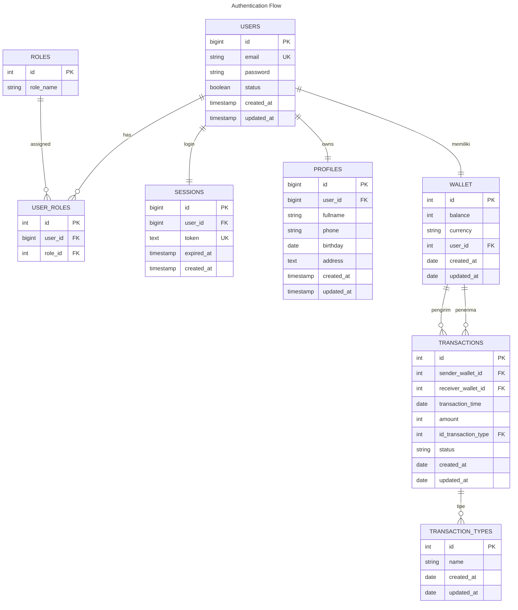

# Membuat ERD Authentication Flow

```mermaid
---
title: Authentication Flow
---

erDiagram

    USERS {
        bigint id PK
        string email UK
        string password
        boolean status
        timestamp created_at
        timestamp updated_at
    }

    ROLES {
        int id PK
        string role_name
    }

    USER_ROLES {
        int id PK
        bigint user_id FK
        int role_id FK
    }

    SESSIONS {
        bigint id PK
        bigint user_id FK
        text token UK
        timestamp expired_at
        timestamp created_at
    }

    PROFILES {
        bigint id PK
        bigint user_id FK
        string fullname
        string phone
        date birthday
        text address
        timestamp created_at
        timestamp updated_at
    }

     WALLET {
        int id PK
        int balance
        string currency
        int user_id FK
        date created_at
        date updated_at
    }

    TRANSACTIONS {
        int id PK
        int sender_wallet_id FK
        int receiver_wallet_id FK
        date transaction_time
        int amount
        int id_transaction_type FK
        string status
        date created_at
        date updated_at
    }

    TRANSACTION_TYPES{
        int id PK
        string name
        date created_at
        date updated_at
    }

    USERS ||--|| WALLET : memiliki
    WALLET ||--o{ TRANSACTIONS : penerima
    WALLET ||--o{ TRANSACTIONS : pengirim
    TRANSACTIONS ||--o{ TRANSACTION_TYPES : tipe

    USERS ||--o{ USER_ROLES : has
    ROLES ||--o{ USER_ROLES : assigned
    USERS ||--|| PROFILES : owns
    USERS ||--|| SESSIONS : login
```